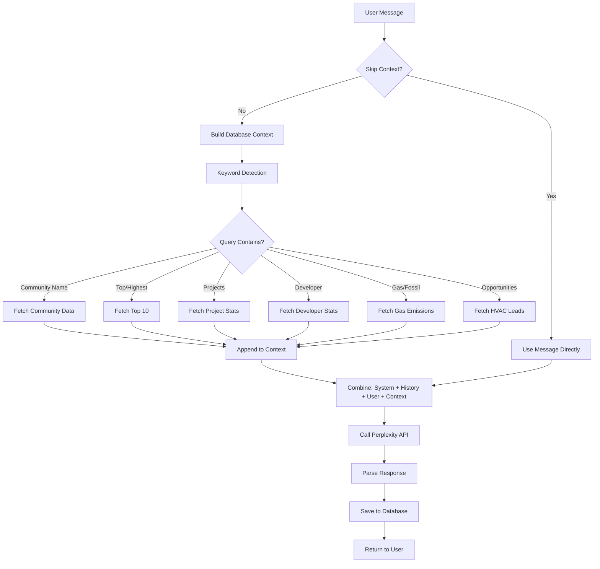

# Perplexity API Integration Guide

## Table of Contents
1. [Overview](#overview)
2. [Architecture](#architecture)
3. [API Routes](#api-routes)
4. [Algorithm Details](#algorithm-details)
5. [Use Cases](#use-cases)
6. [Configuration](#configuration)
7. [Best Practices](#best-practices)

---

## Overview

This application integrates **Perplexity Sonar Reasoning Pro** AI for three primary purposes:
1. **General Chatbot** - Interactive Q&A with database context
2. **Competitive Intelligence** - Market research and company analysis
3. **Contractor Research** - Project-specific consultant/contractor identification

### Why Perplexity Sonar Reasoning Pro?

- **Real-time web access** - Always has current information
- **Reasoning capabilities** - Can analyze and compare complex data
- **Citation support** - Provides sources for all information
- **Image search** - Can find relevant images when needed
- **Structured output** - Supports JSON and markdown responses

---

## Architecture

### System Design

```
User Interface
    │
    ├─> General Chatbot ──> /api/c1-chat
    │                          │
    │                          ├─> Database Context Builder
    │                          ├─> Perplexity API (temp: 0)
    │                          └─> Conversation Storage
    │
    ├─> Intelligence Tab ──> /api/intelligence-research
    │                          │
    │                          ├─> Research Prompts Library
    │                          ├─> Perplexity API (temp: 0.7)
    │                          └─> Markdown/JSON Parser
    │
    └─> Contractor Research ──> /api/c1-chat
                                 │
                                 ├─> Custom Prompts
                                 ├─> Perplexity API (temp: 0)
                                 └─> JSON Parser
```

### Key Files

```
/src/app/api/
  ├─ c1-chat/route.ts                    # General chatbot + contractor research
  └─ intelligence-research/route.ts      # Competitive intelligence research

/src/lib/
  └─ intelligence-prompts.ts             # Research prompt templates

/src/components/
  ├─ AIChatbot.tsx                       # Main chatbot UI
  ├─ CompetitiveIntelligence.tsx         # Intelligence dashboard
  └─ ProjectDetail.tsx                   # Contractor research UI
```

---

## API Routes

### 1. `/api/c1-chat` - General Chatbot & Contractor Research

**Purpose**: Handles conversational AI with BC emissions/projects database context, plus deterministic contractor research.

#### Configuration

```typescript
Model: "sonar-reasoning-pro"
Temperature: 0              // Zero for maximum consistency
Max Tokens: 6000
Top-p: 0.1                  // Very low for deterministic results
Presence Penalty: 0
Frequency Penalty: 0
```

#### Algorithm Flow



#### Context Building Logic

The `buildDataContext()` function intelligently injects relevant database records based on keywords:

| **Keyword Detected** | **Data Retrieved** | **Max Records** |
|----------------------|-------------------|-----------------|
| Community names (vancouver, surrey, etc.) | Specific community emissions | 1 |
| "top", "highest", "largest", "most" | Top communities by emissions | 10 |
| "project", "construction", "development" | Project statistics by status | All statuses |
| "lng", "gas", "pipeline", "energy" | Energy/LNG projects | 10 |
| "developer", "builder" | Top developers by value | 10 |
| "fossil", "gas heating", "natural gas" | High gas emission communities | 10 |
| "opportunity", "lead", "potential" | HVAC conversion opportunities | 10 |

#### Example Request

```javascript
POST /api/c1-chat
Content-Type: application/json

{
  "messages": [
    { "role": "user", "content": "What are the top 5 communities by emissions?" }
  ],
  "skipContext": false,        // Set true to skip database context
  "customSystemPrompt": null,  // Override default system prompt
  "return_images": false,      // Request image search
  "image_domain_filter": [],   // Limit image domains
  "image_format_filter": []    // Limit image formats (jpeg, png, etc.)
}
```

#### Response Format

```json
{
  "id": "chatcmpl-1234567890",
  "object": "chat.completion",
  "created": 1737158400,
  "model": "sonar-reasoning-pro",
  "choices": [
    {
      "index": 0,
      "message": {
        "role": "assistant",
        "content": "Based on the data, here are the top 5 communities..."
      },
      "finish_reason": "stop"
    }
  ],
  "citations": [
    "https://source1.com",
    "https://source2.com"
  ],
  "images": []
}
```

---

### 2. `/api/intelligence-research` - Competitive Intelligence

**Purpose**: Comprehensive market research with higher creativity/diversity for thorough analysis.

#### Configuration

```typescript
Model: "sonar-reasoning-pro"
Temperature: 0.7            // Higher for comprehensive research
Max Tokens: 8000           // More tokens for detailed responses
Top-p: 0.9                 // Allow diverse, creative responses
```

#### Algorithm Flow

```
User Request (Company Analysis)
    │
    ├─> Select Research Category
    │   (product_strategy, financial_performance, etc.)
    │
    ├─> Fill Prompt Template
    │   - Replace {COMPETITOR_NAME}
    │   - Replace {COMPETITOR_A/B/C}
    │
    ├─> Add Intelligence System Prompt
    │   "You are a competitive intelligence analyst..."
    │
    ├─> Call Perplexity API
    │   - Higher temperature (0.7)
    │   - More tokens (8000)
    │   - Broader top-p (0.9)
    │
    ├─> Parse Response
    │   - Strip <think> tags from reasoning model
    │   - Detect format (JSON vs Markdown)
    │
    └─> Return to UI
        - Flag as isMarkdown if not JSON
        - Include citations
```

#### Research Categories

The system includes 10 pre-defined research prompt templates:

| **Category** | **Cadence** | **Focus** | **Output** |
|-------------|------------|-----------|------------|
| `product_strategy` | Daily | Product launches, strategic moves | Markdown |
| `market_trends` | Daily | Emerging HVAC trends | JSON |
| `competitive_positioning` | Weekly | Market positioning comparison | JSON |
| `customer_pain_points` | Weekly | Customer complaints & needs | JSON |
| `market_gaps` | Weekly | Underserved segments | Markdown |
| `financial_performance` | Monthly | Revenue, margins, market share | JSON |
| `regulatory` | Monthly | Regulations, tariffs, compliance | Markdown |
| `partnerships_ma` | Weekly | Partnerships, acquisitions | JSON |
| `sales_marketing` | Daily | Marketing strategy, campaigns | JSON |
| `technology_roadmap` | Monthly | Tech priorities, R&D | Markdown |

#### Prompt Template Example

```typescript
// From intelligence-prompts.ts
{
  id: "financial_performance",
  name: "Financial & Performance Data",
  cadence: "monthly",
  template: `Analyze {COMPETITOR_NAME}'s financial performance in the HVAC sector (2025-2026).

Return ONLY valid JSON in this exact structure:
{
  "financials": {
    "revenueBillions": number,
    "revenueGrowthPercent": number,
    "marketSharePercent": number,
    "grossMarginPercent": number,
    "operatingMarginPercent": number,
    "fiscalYear": "2025"
  },
  "segmentBreakdown": [
    {
      "segment": "segment name",
      "revenuePercent": number,
      "growth": number
    }
  ],
  ...
}`,
  variables: ["COMPETITOR_NAME"]
}
```

#### Example Request

```javascript
POST /api/intelligence-research
Content-Type: application/json

{
  "messages": [
    {
      "role": "user",
      "content": "Analyze Daikin's financial performance in the HVAC sector..."
    }
  ],
  "returnJson": false  // Set true to prefer JSON over markdown
}
```

---

### 3. Contractor Research Algorithm

**Purpose**: Identify mechanical consultants and general contractors likely to work on a specific project.

#### Special Configuration

```typescript
// Uses /api/c1-chat but with:
- skipContext: true              // No database context
- customSystemPrompt: true       // Specialized contractor prompt
- temperature: 0                 // Maximum determinism
- top_p: 0.1                     // Consistent rankings
- presence_penalty: 0
- frequency_penalty: 0
```

#### Specialized System Prompt

```typescript
const CONTRACTOR_SYSTEM_PROMPT = `You are a construction industry analyst...

CRITICAL INSTRUCTIONS:
1. ALWAYS return the same established firms for the same project
2. NEVER return random or obscure firms
3. Return ONLY valid JSON, no markdown, no explanation
4. Focus on these established firms:

MECHANICAL CONSULTANTS: WSP, Stantec, Morrison Hershfield, 
Keen Engineering, Integral Group, MCW Consultants, AME Group, 
Exp Services, RJC Engineers, Read Jones Christoffersen

GENERAL CONTRACTORS: PCL Constructors, EllisDon, Graham Construction,
Ledcor, Bird Construction, Kiewit, Aecon, Stuart Olson, 
Pomerleau, Chandos Construction
`;
```

#### Scoring Algorithm

Each contractor is scored on a **0-100% likelihood scale** based on:

| **Factor** | **Weight** | **Description** |
|-----------|-----------|----------------|
| **Firm Size & Reputation** | 40% | Market presence, established firms prioritized |
| **Location Fit** | 30% | Proximity to project (Vancouver, BC regions) |
| **Developer Relationship** | 30% | Historical collaboration with project developer |

#### Prompt Structure (Mechanical Consultants)

```
Research mechanical CONSULTING FIRMS for {PROJECT_NAME} in {LOCATION}.
Project Type: {TYPE}
Estimated Value: {VALUE}
Developer: {DEVELOPER}

Find 6-10 mechanical CONSULTANTS (engineering firms that design HVAC systems).
Prioritize established firms like WSP, Stantec, Morrison Hershfield, etc.

For each consultant:
1. Calculate likelihoodScore (0-100):
   - Firm size/reputation: 40%
   - Location fit (BC/Vancouver): 30%
   - Developer relationship: 30%

2. Identify if they've worked with {DEVELOPER} before:
   - workedWithDeveloper: true/false
   - developerRelationship: "specific projects and dates"

3. Provide reasoning for likelihood

Return ONLY valid JSON:
{
  "consultants": [
    {
      "name": "firm name",
      "location": "city",
      "type": "mechanical",
      "specialties": ["HVAC design", "..."],
      "likelihoodScore": 85,
      "likelihoodReasoning": "why this score",
      "workedWithDeveloper": true,
      "developerRelationship": "projects and dates"
    }
  ]
}
```

#### JSON Parsing Logic

The contractor research includes robust JSON parsing:

```typescript
// 1. Strip <think> tags from sonar-reasoning-pro
jsonString = jsonString.replace(/<think>[\s\S]*?<\/think>/gi, '');

// 2. Remove markdown code blocks
jsonString = jsonString.replace(/```json\s*/gi, '');
jsonString = jsonString.replace(/```\s*/gi, '');

// 3. Extract JSON object
const match = jsonString.match(/\{[\s\S]*\}/);
if (match) {
  const parsed = JSON.parse(match[0]);
  return parsed.contractors || parsed.consultants || [];
}
```

#### UI Rendering

Contractors are displayed with:
- **Green highlight** if `workedWithDeveloper === true`
- **Likelihood badge** (Green: 70-100%, Amber: 50-69%, Gray: <50%)
- **Developer relationship box** showing historical projects
- **"Why this contractor"** reasoning section

---

## Use Cases

### Use Case 1: General Business Intelligence Query

**Scenario**: User asks "Which communities have the highest gas emissions?"

**Flow**:
1. Query sent to `/api/c1-chat`
2. Keyword "highest" and "gas" detected
3. Database fetches top 10 communities by `gasEmissions`
4. Context appended: `[Top 10 Communities by Gas Emissions] 1. Vancouver: 45,000 TCO2e...`
5. Perplexity processes with HVAC business context
6. Returns formatted analysis with database facts + real-time insights

### Use Case 2: Competitive Intelligence Research

**Scenario**: User clicks on "Daikin" competitor card

**Flow**:
1. System runs all 10 research prompts in parallel
2. Each prompt sent to `/api/intelligence-research`
3. Templates filled: `{COMPETITOR_NAME}` → "Daikin"
4. Higher temperature (0.7) allows comprehensive research
5. Responses parsed (JSON or Markdown)
6. UI renders in categorized tabs:
   - Products & Strategy (Markdown)
   - Marketing (JSON → Structured UI)
   - Financials (JSON → Charts)
   - Partnerships (JSON → Card Grid)
   - Technology (Markdown)
   - Regulatory (Markdown)

### Use Case 3: Project Contractor Research

**Scenario**: User views "$500M Vancouver Office Tower" and clicks "Mechanical Consultants"

**Flow**:
1. Extract project details: name, location, value, developer
2. Build specialized prompt with pre-defined firm list
3. Send to `/api/c1-chat` with:
   - `skipContext: true`
   - `customSystemPrompt: CONTRACTOR_SYSTEM_PROMPT`
   - `temperature: 0` (deterministic)
4. Perplexity reasons about:
   - Firm reputation and size
   - Geographic proximity
   - Developer relationships (searches historical projects)
5. Returns JSON with 6-10 consultants, scored 0-100%
6. UI highlights firms with developer relationships
7. Same query always returns same firms (due to temp=0)

---

## Configuration

### Environment Variables

```bash
# .env.local
PERPLEXITY_API_KEY=pplx-xxxxxxxxxxxxxxxxxxxxxxxxxxxxxxxxxxxxxxxx
```

**Important**: Never commit the actual API key. Use environment variables only.

### API Parameters Comparison

| **Use Case** | **Temperature** | **Top-p** | **Max Tokens** | **Why?** |
|-------------|----------------|-----------|----------------|----------|
| General Chat | 0 | 0.1 | 6000 | Factual, deterministic responses |
| Intelligence | 0.7 | 0.9 | 8000 | Comprehensive, creative research |
| Contractor Research | 0 | 0.1 | 6000 | Consistent, repeatable results |

### Model: sonar-reasoning-pro

**Why this model?**
- **Web-grounded**: Real-time access to current information
- **Reasoning**: Can analyze relationships and compare data
- **Citations**: Provides sources for verification
- **Structured output**: Better at following JSON schemas
- **`<think>` tags**: Shows internal reasoning (stripped in responses)

---

## Best Practices

### 1. Temperature Settings

**Rule of Thumb**:
- **Temperature 0** = Same input always produces same output (deterministic)
- **Temperature 0.7-0.9** = Creative, diverse, comprehensive responses
- **Use 0** for: Contractor research, factual queries, JSON extraction
- **Use 0.7+** for: Market research, trend analysis, creative insights

### 2. Prompt Engineering

**For Deterministic Results**:
```typescript
// ✅ Good: Explicit, deterministic prompt
"Return ONLY these established firms: WSP, Stantec, Morrison Hershfield.
Calculate exact likelihood score based on:
1. Firm size/reputation (40%)
2. Location fit (30%)
3. Developer relationship (30%)"

// ❌ Bad: Vague, allows randomness
"Find some mechanical consultants for this project"
```

**For Comprehensive Research**:
```typescript
// ✅ Good: Open-ended, encourages thoroughness
"Provide comprehensive analysis of Daikin's marketing strategy in 2025-2026.
Include messaging, positioning, campaigns, channels, and pricing.
Cite all sources."

// ❌ Bad: Too restrictive
"What is Daikin's marketing strategy? (one sentence)"
```

### 3. JSON Extraction

**Always handle malformed responses**:

```typescript
// Perplexity sonar-reasoning-pro may return:
// <think>internal reasoning</think>
// ```json
// { "actual": "data" }
// ```

function parseContractorJSON(response: string) {
  // 1. Strip reasoning tags
  let clean = response.replace(/<think>[\s\S]*?<\/think>/gi, '');
  
  // 2. Remove markdown code blocks
  clean = clean.replace(/```json\s*/gi, '');
  clean = clean.replace(/```\s*/gi, '');
  
  // 3. Extract JSON object
  const match = clean.match(/\{[\s\S]*\}/);
  if (!match) return [];
  
  // 4. Parse and validate
  const parsed = JSON.parse(match[0]);
  return parsed.contractors || parsed.consultants || [];
}
```

### 4. Context Management

**Database Context Strategy**:
- ✅ Add context for: Community queries, project questions, HVAC opportunities
- ❌ Skip context for: General research, competitive intelligence, contractor queries
- 💡 Limit context to relevant records (use keyword detection)

### 5. Error Handling

```typescript
// Always handle API errors gracefully
try {
  const response = await fetch(PERPLEXITY_API_URL, {
    method: "POST",
    headers: {
      "Authorization": `Bearer ${apiKey}`,
      "Content-Type": "application/json",
    },
    body: JSON.stringify(requestBody),
  });

  if (!response.ok) {
    const errorText = await response.text();
    console.error("Perplexity API error:", errorText);
    return NextResponse.json(
      { error: `API error: ${response.status}` },
      { status: response.status }
    );
  }

  const data = await response.json();
  return data;
  
} catch (error) {
  console.error("Unexpected error:", error);
  return { error: "Internal server error" };
}
```

### 6. Rate Limiting & Caching

**Current Implementation**: No caching (always fresh data)

**Recommendations for Production**:
- Cache intelligence research for 24 hours
- Cache contractor research per project for 7 days
- Don't cache general chat (needs real-time context)
- Implement exponential backoff for rate limit errors

```typescript
// Example caching strategy
const cacheKey = `contractor-research-${projectId}-${type}`;
const cached = await redis.get(cacheKey);
if (cached) return JSON.parse(cached);

// ... perform research ...

await redis.set(cacheKey, JSON.stringify(results), 'EX', 604800); // 7 days
```

---

## Debugging

### Common Issues

#### 1. "API key not configured"
```bash
# Check environment variable is set
echo $PERPLEXITY_API_KEY

# In code, verify it's loaded
console.log("API Key exists:", !!process.env.PERPLEXITY_API_KEY);
```

#### 2. "No contractors found"
- Check prompt includes pre-defined firm list
- Verify temperature is 0 (not randomizing)
- Ensure JSON parsing strips `<think>` tags
- Log raw API response for inspection

#### 3. "Objects are not valid as React child"
- Perplexity returned nested objects
- Use `RenderValue` component or `safeStringify` helper
- Don't render objects directly: `{data.field}` ❌
- Stringify first: `{JSON.stringify(data.field)}` ✅

#### 4. "401 Unauthorized"
- API key is invalid or expired
- Check shell environment doesn't override `.env.local`
- Restart dev server after changing `.env.local`

---

## Performance Metrics

### Typical Response Times

| **Endpoint** | **Avg Response** | **Max Tokens** | **Cost** |
|-------------|-----------------|----------------|----------|
| `/api/c1-chat` (with context) | 3-5 seconds | ~2000-3000 | $0.03-0.05 |
| `/api/c1-chat` (contractor) | 4-7 seconds | ~3000-4000 | $0.05-0.07 |
| `/api/intelligence-research` | 6-10 seconds | ~4000-6000 | $0.08-0.12 |

**Note**: Costs are estimates based on Perplexity's pricing. Actual costs may vary.

---

## Future Enhancements

### Planned Improvements

1. **Caching Layer**
   - Redis cache for intelligence research (24hr TTL)
   - Project-specific contractor cache (7-day TTL)

2. **Batch Processing**
   - Queue-based research for multiple competitors
   - Background job processing for large-scale analysis

3. **Enhanced Scoring**
   - Machine learning model for contractor likelihood
   - Historical performance tracking
   - Real-time project win/loss data integration

4. **Image Integration**
   - Enable `return_images` for contractor research
   - Display company logos, project photos
   - Filter by domain (linkedin.com, company websites)

5. **Advanced Analytics**
   - Track query patterns and popular topics
   - A/B test different prompt templates
   - Measure research accuracy over time

---

## Resources

- **Perplexity API Docs**: https://docs.perplexity.ai
- **Sonar Models Guide**: https://docs.perplexity.ai/guides/model-cards
- **Rate Limits**: https://docs.perplexity.ai/guides/rate-limits
- **Best Practices**: https://docs.perplexity.ai/guides/best-practices

---

## License

This integration is proprietary to the BC Emissions Interactive Map application.

---

**Last Updated**: January 17, 2026
**Version**: 1.0.0

